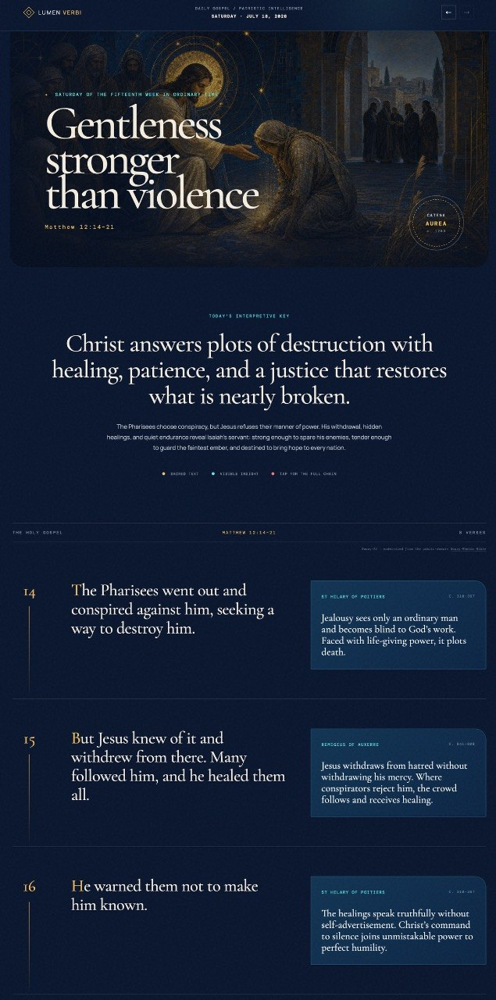

# Lumen Verbi

Lumen Verbi is a daily Catholic Gospel reader that brings Scripture and the voices of the Church Fathers into one contemplative, visual experience.

**Live site:** [jonathanaquino.com/gospel](https://jonathanaquino.com/gospel/)



Each daily page pairs:

- the Gospel appointed for the day in **Douay-AI**, a careful modernization of the public-domain Douay-Rheims Bible;
- verse-by-verse insights drawn from St Thomas Aquinas's *Catena Aurea*;
- original commentary that renders the Fathers' reasoning in clear modern English; and
- original sacred artwork inspired by Byzantine mosaic, stained glass, and illuminated manuscripts.

The aim is not merely to explain the Gospel, but to make it easier to linger with it.

## What is Douay-AI?

Douay-AI begins with the public-domain Douay-Rheims Bible and modernizes archaic pronouns, verb forms, punctuation, and sentence structure for the modern ear. It preserves the source passage's meaning, verse boundaries, names, theological claims, and Catholic terminology.

Douay-AI is not an approved liturgical translation and is not presented as one. The USCCB daily readings calendar is used only to identify the day's Gospel citation; copyrighted Lectionary and NAB wording is not reproduced.

## Patristic sources

The commentary begins with the matching section of the *Catena Aurea*, St Thomas Aquinas's verse-by-verse anthology of the Church Fathers. Public-domain editions such as John Henry Newman's English translation are preferred. Each displayed insight names the Father whose interpretation it follows.

The visible insights and expanded commentary are newly written summaries, not quotations presented as the Fathers' exact words.

## Running locally

Lumen Verbi requires PHP and no database.

```bash
php -S localhost:8000
```

Then open <http://localhost:8000>.

The application selects the newest file in `data/` by default. A particular entry can be opened with `?date=YYYY-MM-DD`.

## Project structure

```text
assets/       Daily original artwork
data/         One JSON document per Gospel entry
app.js        Page interactions
index.php     Entry selection and rendering
styles.css    Visual design
PLAYBOOK.md   Daily publishing procedure
```

## Sources and rights

- The Douay-Rheims Bible source text is in the public domain.
- The Newman translation of the *Catena Aurea* used as a research source is in the public domain.
- Douay-AI renderings, original commentary, application code, and original site assets are released under the MIT License unless otherwise noted.
- External source sites and linked materials remain subject to their own terms.

## License

[MIT](LICENSE) © 2026 Jonathan Aquino
